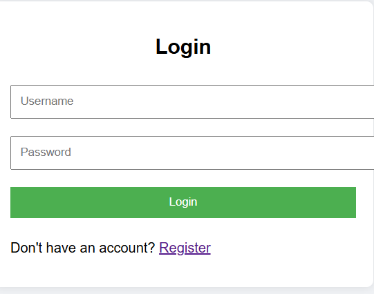
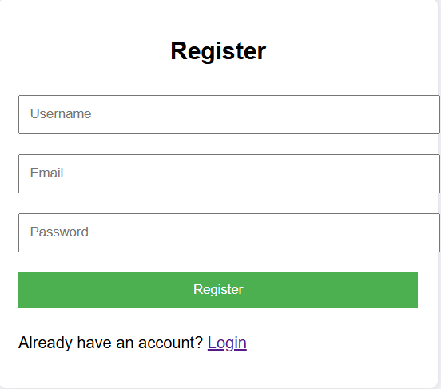
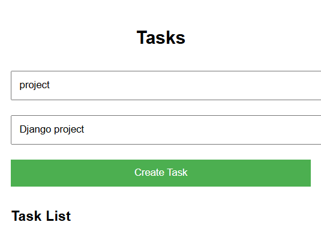
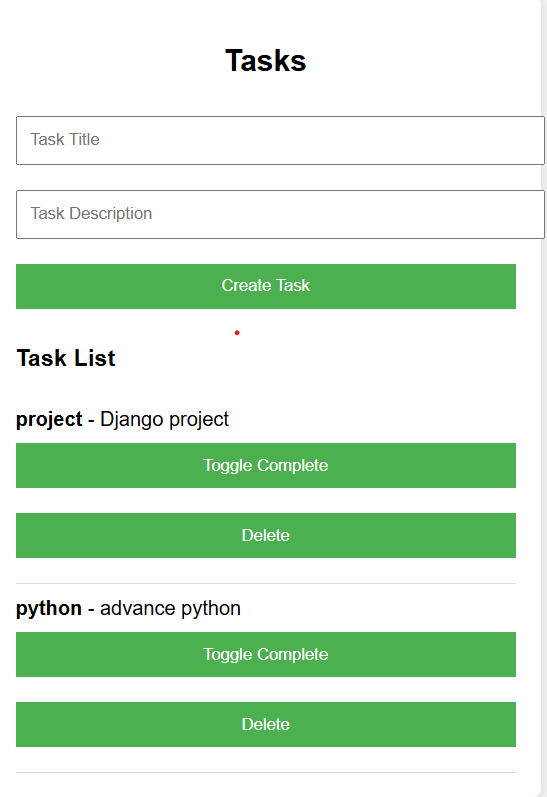
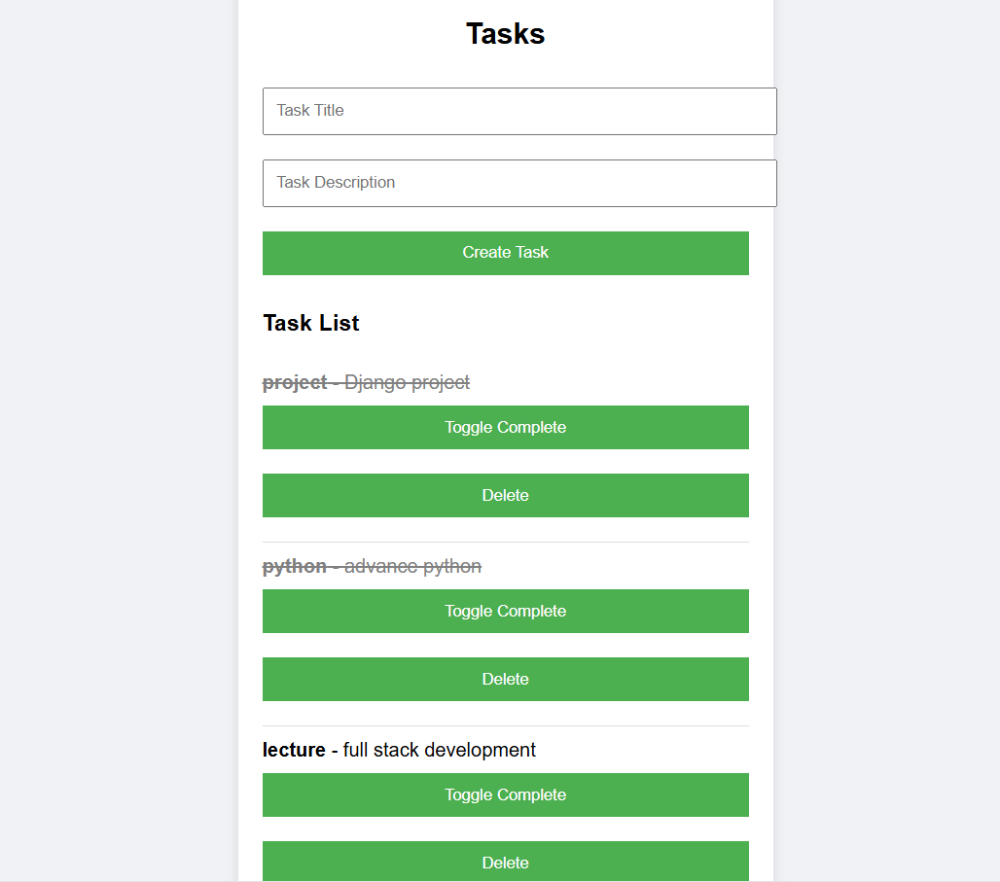

# 📝 Task Manager Project

**Description:**  
This is a **simple Task Manager web application** built using **Django** and **Django REST Framework (DRF)**.  
Users can **register, login, create tasks, toggle completion, and delete tasks**.  

---

## ✨ Features

- **User Registration & Login** with JWT authentication  
- **Create New Tasks**  
- **View Tasks**  
  - Normal users: own tasks  
  - Admin/Manager: all tasks  
- **Toggle Task Completion**  
- **Delete Tasks**

---

## 📸 Screenshots
🏠 **Login Page:**  


🏠 **Register:**  


🏠 **task:**  


🏠 **tasklist:**  


🏠 **toggle:**  



---

## ⚙️ Setup Instructions

1. **Clone the repository**  
2. **Create a virtual environment**:
      python -m venv venv
3.**Activate the virtual environment:**
     Windows: venv\Scripts\activate
     Mac/Linux: source venv/bin/activate
4.**Install dependencies:**
   pip install -r requirements.txt
5.**Run migrations:**
   python manage.py migrate
6.**Run the development server:**
   python manage.py runserver

## 📦 Dependencies
      Django==4.2.7
      djangorestframework==3.20.1
      djangorestframework-simplejwt==6.2.0

## 💻 Usage
      Register a new user or login.
      Create tasks using the form.
      Toggle task completion using the Toggle Complete button.
      Delete tasks using the Delete button.
   ```bash
   python -m venv venv
